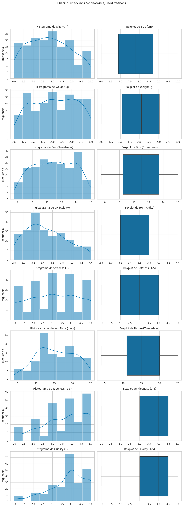
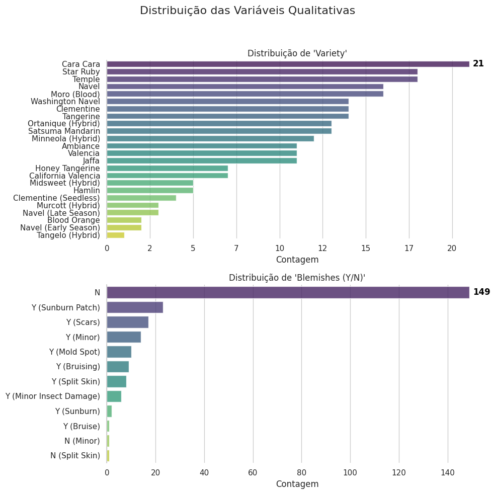
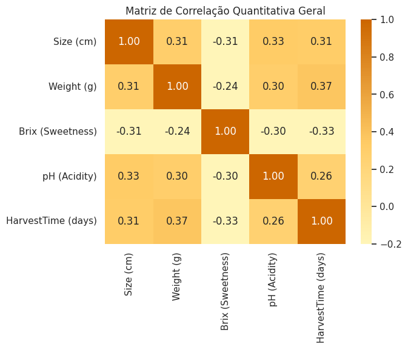
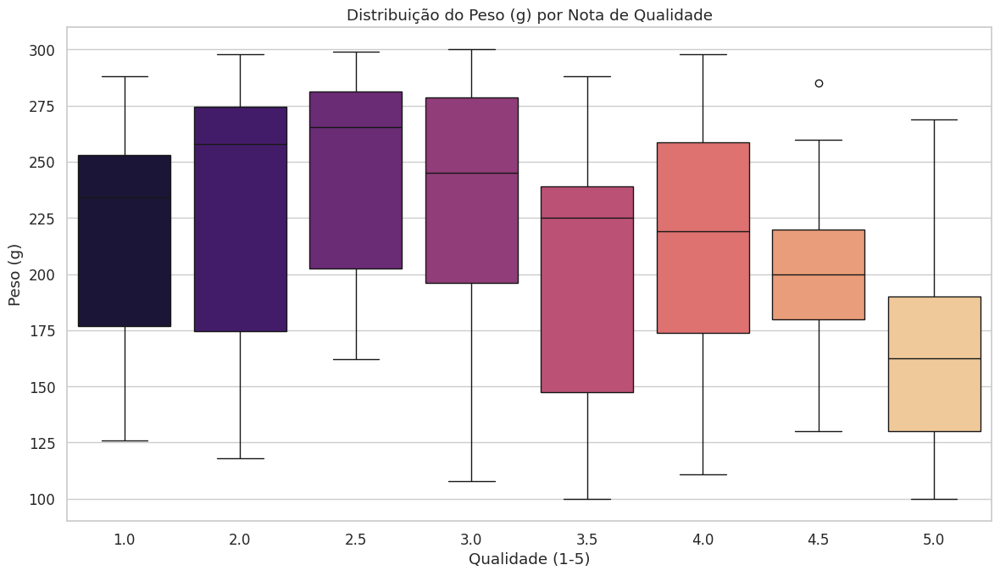
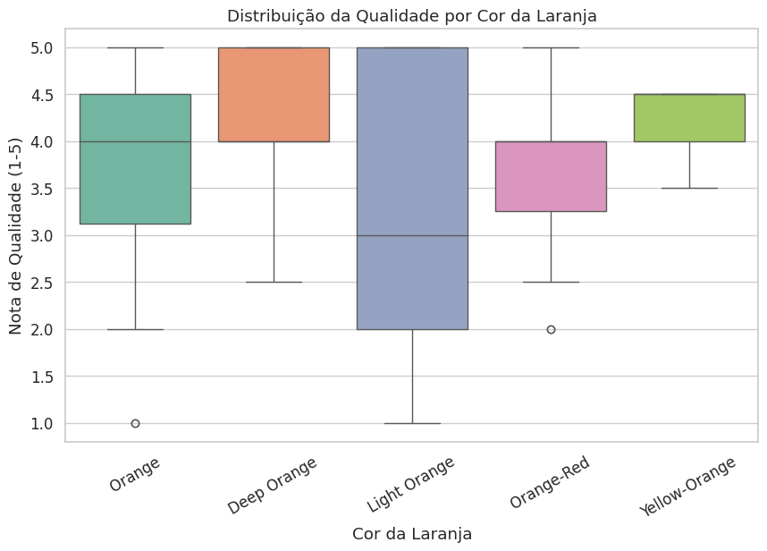

# 🍊 ANÁLISE EXPLORATÓRIA DE DADOS AGRÍCOLAS – PREVISÃO E QUALIDADE DE PRODUÇÃO

## 📋 Sobre o Projeto

Este projeto apresenta uma **Análise Exploratória de Dados (EDA)** realizada sobre um dataset de qualidade de laranjas, com o objetivo de identificar quais características físicas, químicas e visuais influenciam a qualidade final da fruta.

A análise foi desenvolvida como parte do processo de aprendizagem em Ciência e Análise de Dados, utilizando técnicas de estatística descritiva, visualização de dados e investigação de relações entre variáveis do Bootcamp de ciência de dados do Instituto Atlântico Avanti em parceria com a Softex.

---

## 🎯 Objetivos

* Compreender a distribuição das variáveis do dataset.
* Identificar fatores associados à qualidade das laranjas.
* Explorar correlações entre características físicas e químicas.
* Gerar insights que possam apoiar decisões na produção agrícola.
* Aplicar técnicas de visualização de dados para comunicação dos resultados.

---

## 📊 Dataset

O conjunto de dados contém informações relacionadas às características das laranjas, incluindo:

| Variável    | Descrição           |
| ----------- | ------------------- |
| Size        | Tamanho da fruta    |
| Weight      | Peso da fruta       |
| Brix        | Índice de doçura    |
| pH          | Nível de acidez     |
| Softness    | Maciez              |
| HarvestTime | Tempo de colheita   |
| Ripeness    | Grau de maturação   |
| Color       | Cor da fruta        |
| Variety     | Variedade           |
| Blemishes   | Presença de manchas |
| Quality     | Nota de qualidade   |

---

## 🛠️ Tecnologias Utilizadas

* Python
* Pandas
* NumPy
* Matplotlib
* Seaborn
* Scikit-Learn
* Google Colab

---

## 🔍 Etapas da Análise

### 1. Carregamento e Exploração Inicial

* Importação dos dados
* Verificação da estrutura do dataset
* Identificação de tipos de variáveis
* Estatísticas descritivas

### 2. Limpeza dos Dados

* Verificação de valores ausentes
* Verificação de duplicidades
* Análise de consistência dos dados

### 3. Análise Univariada

Avaliação individual das variáveis:

* Distribuição do tamanho
* Distribuição do peso
* Distribuição do Brix
* Distribuição da qualidade
* Distribuição das categorias

### 4. Análise Bivariada

Investigação das relações entre variáveis:

* Brix × Qualidade
* Peso × Qualidade
* Tamanho × Qualidade
* Tempo de Colheita × Qualidade
* pH × Qualidade

### 5. Análise Multivariada

* Heatmap de correlações
* Relações entre variáveis numéricas
* Identificação dos fatores mais relevantes para a qualidade

---

# 💡 Principais Insights

### 🍯 A doçura é o principal indicador de qualidade

O índice Brix apresentou forte relação positiva com a qualidade das frutas.

**Conclusão:** quanto maior a concentração de açúcar, maior tende a ser a qualidade percebida.

---

### ⏱️ Existe uma janela ideal de colheita

Os melhores resultados foram observados em frutas colhidas aproximadamente entre 10 e 18 dias.

**Conclusão:** colheitas tardias tendem a reduzir a qualidade.

---

### ⚖️ Maior não significa melhor

Peso e tamanho não demonstraram ser os melhores preditores de qualidade.

**Conclusão:** frutas menores podem apresentar qualidade superior.

---

### 🍊 A aparência influencia a percepção de qualidade

Frutas sem manchas apresentaram avaliações superiores.

**Conclusão:** aspectos visuais continuam sendo importantes indicadores para classificação.

---

### 🧪 Acidez e textura precisam estar equilibradas

Valores extremos de pH e maciez tendem a impactar negativamente a qualidade.

**Conclusão:** o equilíbrio dessas características favorece melhores avaliações.

---
# 📈 Principais Visualizações e Insights

## 1. Distribuição das Variáveis Quantitativas



A análise das variáveis quantitativas mostrou a distribuição das características físicas e químicas das laranjas, permitindo identificar padrões de concentração e dispersão dos dados.

---

## 2. Distribuição das Variáveis Qualitativas



As variáveis categóricas permitiram observar a frequência das diferentes classificações de cor, variedade e presença de manchas.
  
## 3. Matriz de Correlação das Variáveis Quantitativas



**Insight:** O índice de doçura (Brix) apresentou uma das relações mais fortes com a qualidade das frutas, indicando que o sabor é um fator relevante para a classificação final.

## 4. Relação entre Brix e Qualidade

 por nota de qualidade.png)

**Insight:** À medida que a qualidade aumenta, observa-se uma tendência de aumento nos níveis médios de Brix.

## 5. Peso e Qualidade



**Insight:** Frutas maiores ou mais pesadas não necessariamente apresentam melhor qualidade.

## 6. Qualidade por Cor



**Insight:** Algumas colorações apresentaram maior concentração de frutas classificadas com notas superiores.

---

# 🤖 Modelagem Preditiva

Além da análise exploratória, foram avaliados modelos de Machine Learning para prever a qualidade das laranjas.

Modelos testados:

* Regressão Logística
* K-Nearest Neighbors (KNN)
* Árvore de Decisão
* Random Forest
* Support Vector Classifier (SVC)

Objetivo:

Identificar qual algoritmo apresenta melhor desempenho na classificação da qualidade das frutas.

---

# 📑 Apresentação dos Resultados

Os principais insights deste projeto também estão disponíveis em formato de apresentação.

📎 **Slides do Projeto**

[Visualizar Apresentação em PDF](./slides/apresentacao_dados.pdf)

---

# 📂 Estrutura do Projeto

```text
📦 Analise-sobre-Dataset-Laranjas
│
├── imagens/
├── notebooks/
│   └── Orange_Quality_Analysis.ipynb
│
├── slides/
│   └── apresentacao_dados.pdf
│
└── README.md
```

---

# 👥 Equipe

* Ana Marly Couto
* José Abílio
* Romeu Róseo
* Vanessa Fermino

---

# 🚀 Próximos Passos

* Construção de modelos preditivos mais robustos
* Otimização de hiperparâmetros
* Dashboard interativo em Power BI
* Deploy de modelo de classificação
* Comparação entre diferentes variedades de laranja

---

⭐ Se este projeto foi útil para você, considere deixar uma estrela no repositório.

---
